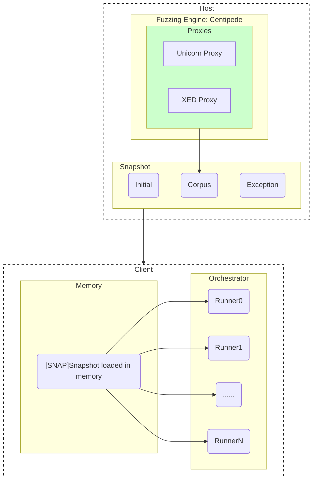

## 1. Installation

### 1.1. Create container with docker

```bash
git clone https://github.com/jimmysitu/silifuzz.git
git checkout docs
SILIFUZZ_SRC_DIR=`pwd`
docker run -it --tty --security-opt seccomp=unconfined \
    --mount type=bind,source=${SILIFUZZ_SRC_DIR},target=/app \
    --name silifuzz-debian-bookworm --network host \
    debian:bookworm /bin/bash
```

### 1.2. Install build dependencies and set environment variables

Install build dependencies for Debian Bookworm
```bash
cd /app
./install_build_dependencies.debian_bookworm.sh
```

To exit the container, run `exit`.
To restart the container, run `docker start -ai silifuzz-debian-bookworm`.

For simplicity, set `SILIFUZZ_SRC_DIR` to the path of the silifuzz source directory.

```bash
export SILIFUZZ_SRC_DIR=/app
```
And set `SILIFUZZ_BIN_DIR` to the path of the binaries, which is `/app/bazel-bin`.

```bash
export SILIFUZZ_BIN_DIR=/app/bazel-bin
```

### 1.3. Build Silifuzz

Build all the targets and test silifuzz
```bash
cd /app
bazel build ...
bazel test ...
```
If all tests pass, Silifuzz is ready to use.

### Build Tools
```bash
bazel build -c opt @silifuzz//tools:{snap_corpus_tool,fuzz_filter_tool,snap_tool,silifuzz_platform_id,simple_fix_tool_main} \
     @silifuzz//runner:reading_runner_main_nolibc \
     @silifuzz//orchestrator:silifuzz_orchestrator_main
```

### Build Unicorn Proxy
```bash
cd "${SILIFUZZ_SRC_DIR}"
COV_FLAGS_FILE="$(bazel info output_base)/external/com_google_fuzztest/centipede/clang-flags.txt"
bazel build -c opt --copt=-UNDEBUG --dynamic_mode=off \
  --per_file_copt=unicorn/.*@$(xargs < "${COV_FLAGS_FILE}" |sed -e 's/,/\\,/g' -e 's/ /,/g') \
  @//proxies:unicorn_x86_64
```

### Build Centipede
```bash
bazel build -c opt @com_google_fuzztest//centipede:centipede
```
## 2. Run Silifuzz

### 2.1. Fuzz the Unicorn proxy under Centipede

```bash
# Fuzz the Unicorn proxy under Centipede with parallelism of 30 and 1000 runs.
"${SILIFUZZ_BIN_DIR}/external/com_google_fuzztest/centipede/centipede" \
  --binary="${SILIFUZZ_BIN_DIR}/proxies/unicorn_x86_64" \
  --workdir=/tmp/wd \
  --j=4 --num_runs=1000
```
#### Introduction to Unicorn
- A quick start guide to Unicorn engine can be found [here](https://www.unicorn-engine.org/docs/tutorial.html)

- Unicorn is the fuzz target, for more information about fuzz target, please refer to [here](https://github.com/google/fuzzing/blob/master/docs/good-fuzz-target.md)
  - The entry point of a fuzz target is the function `LLVMFuzzerTestOneInput`, which is defined in `proxies/unicorn_x86_64.cc`.
  ```c++
  extern "C" int LLVMFuzzerTestOneInput(const uint8_t *data, size_t size)
  ```


#### Introduction to Centipede
- Introduction to Centipede can be found [here](https://github.com/google/fuzztest/blob/main/centipede/README.md)

- Centipede is fully compatible with libFuzzer, a complete tutorial of libFuzzer can be found [here](https://github.com/google/fuzzing/blob/master/tutorial/libFuzzerTutorial.md)
  - An introduction to libFuzzer can be found [here](https://llvm.org/docs/LibFuzzer.html), which introduces the concept of centipede.


- The output of Centipede is corpus, which is a set of inputs that have been successfully fuzzed.
- For more information about corpus, please refer to [here](https://llvm.org/docs/LibFuzzer.html#corpus)

##### Corpus Distillation
```bash
"${SILIFUZZ_BIN_DIR}/external/com_google_fuzztest/centipede/centipede" \
  --binary="${SILIFUZZ_BIN_DIR}/proxies/unicorn_x86_64" \
  --workdir=/tmp/wd \
  --distill --num_threads=1 --total_shards=4
```

#### Create Runnable Corpus

```bash
# Convert fuzzing result corpus.* into a 10-shard runnable corpus for the current architecture
"${SILIFUZZ_BIN_DIR}/tools/simple_fix_tool_main" \
  --num_output_shards=10 \
  --output_path_prefix=/tmp/wd/runnable-corpus \
  /tmp/wd/corpus.*
```


## Silifuzz Framework

<div align="center" style="width: 80%">



</div>